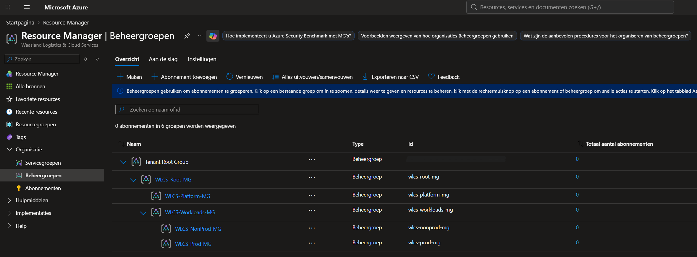
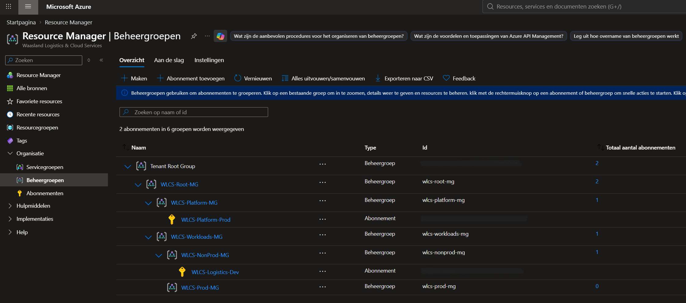
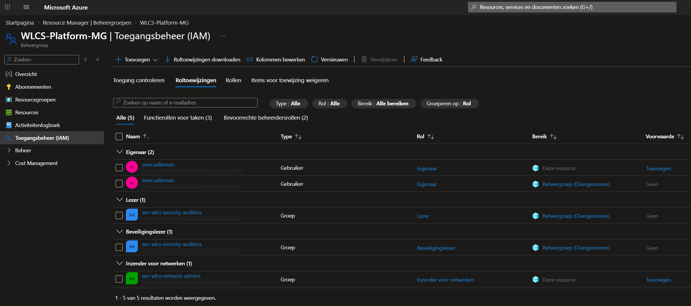
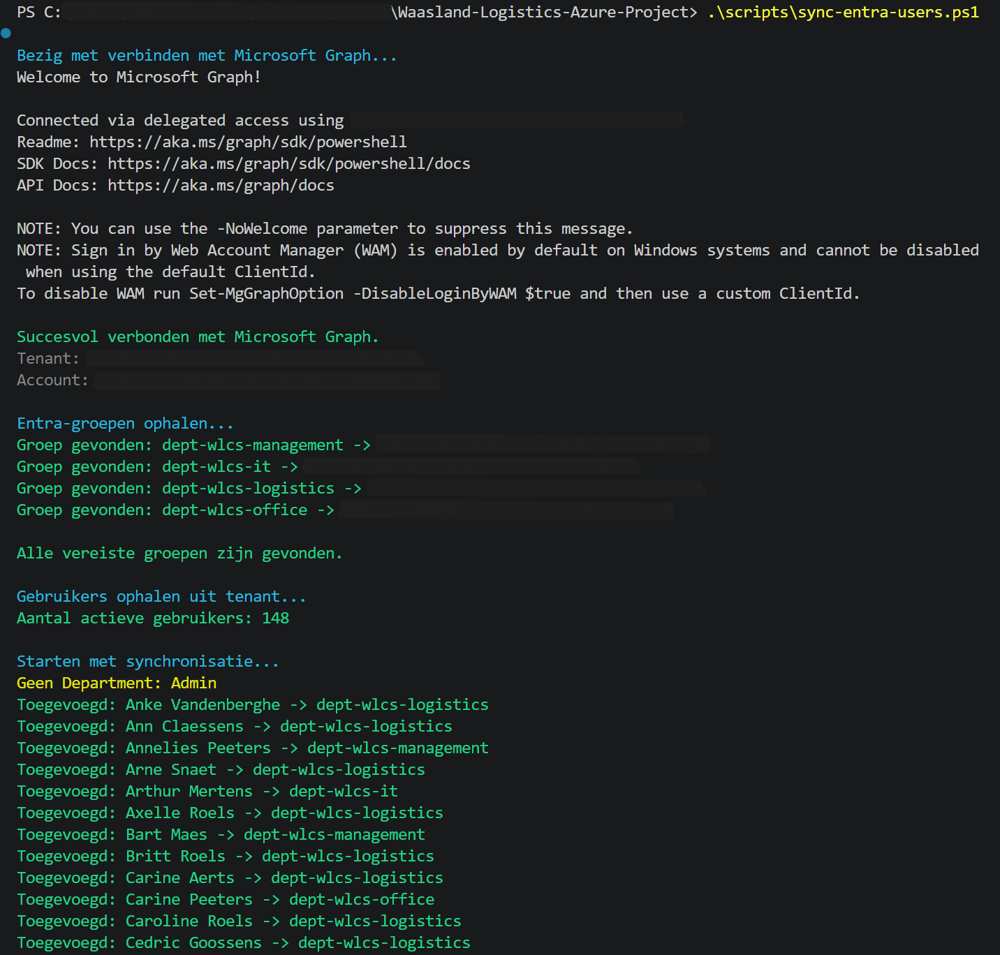
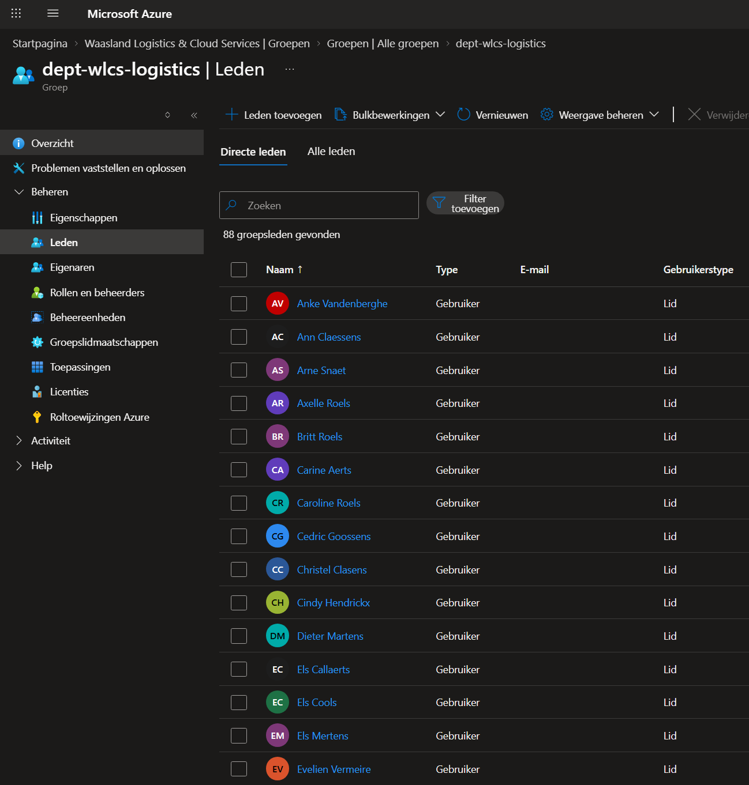
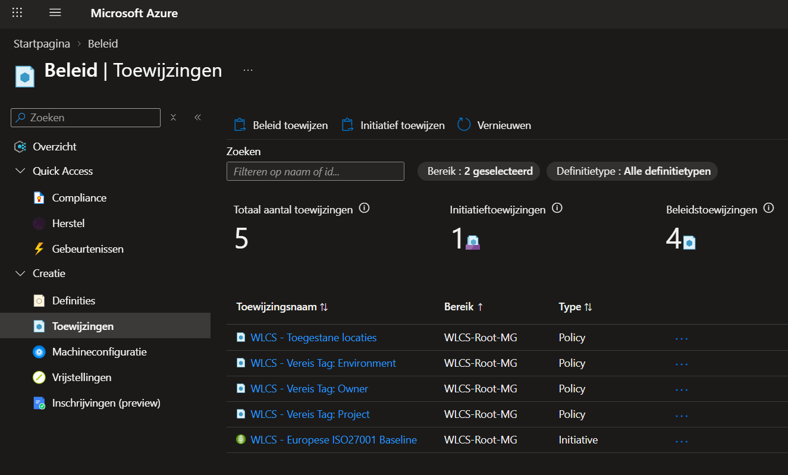
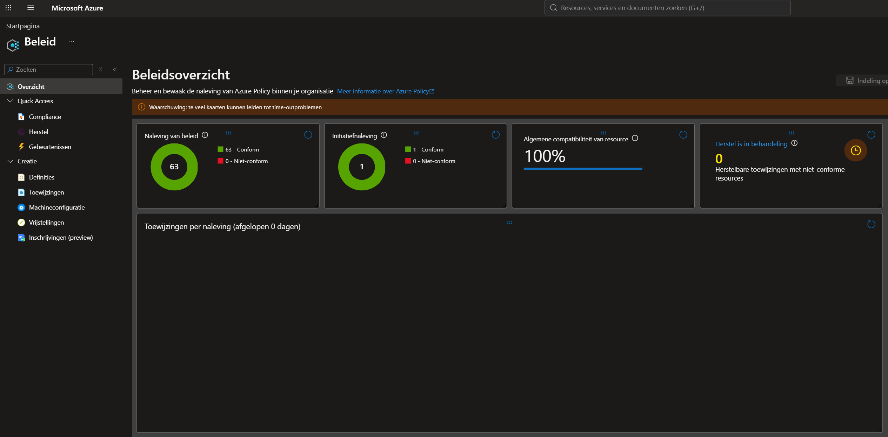
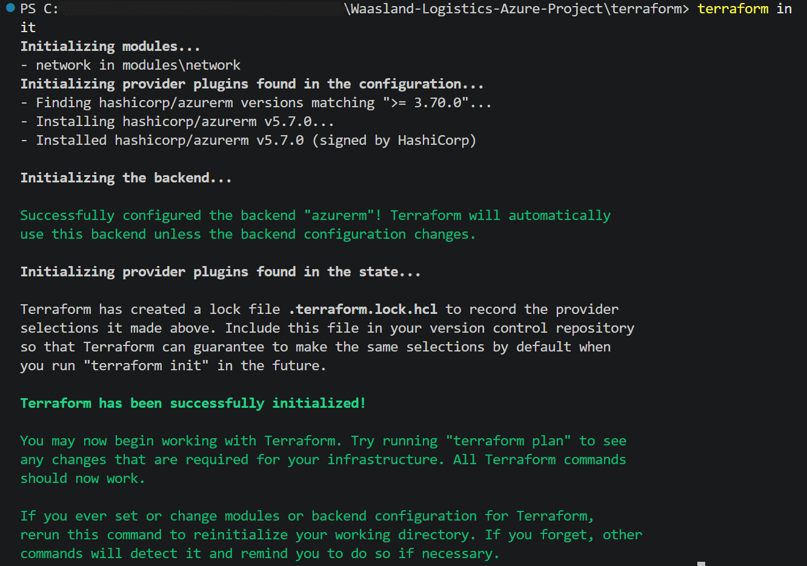
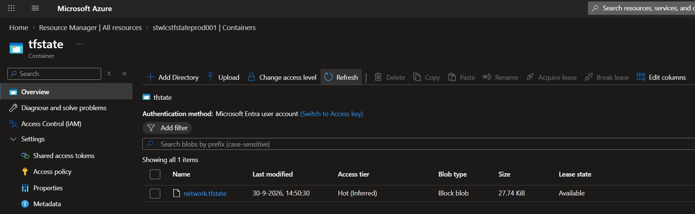
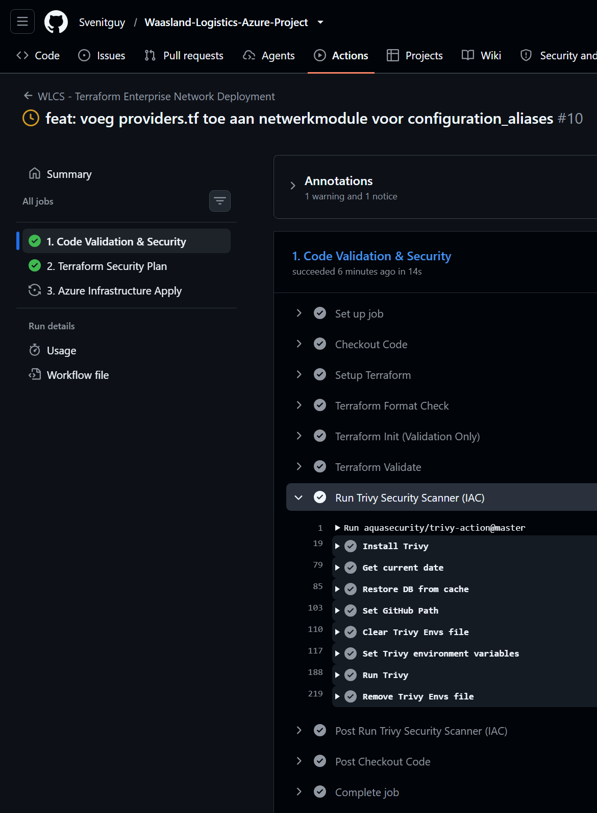

# Waasland Logistics & Cloud Services (WLCS) - Azure Cloud Enterprise Project

Welkom bij het cloud-infrastructuurproject voor **Waasland Logistics & Cloud Services**. In dit project bouw ik een volledige enterprise-omgeving op van A tot Z binnen Microsoft Azure, strikt conform de richtlijnen van het **Microsoft Cloud Adoption Framework (CAF)** en het **Well-Architected Framework (WAF)**.

## Project Status & Voortgang
- [x] **Fase 1: Governance & Fundering** (Voltooid)
- [x] **Fase 2: Core Netwerkinfrastructuur (Hub-Spoke)** (Voltooid)
- [ ] **Fase 3: Compute, Storage & Bedrijfsapplicatie**
- [ ] **Fase 4: WAF Optimalisatie (Security, Monitoring & Budget)**
- [ ] **Fase 5: Infrastructure as Code (IaC) Vertaling**

---

## Fase 1: Governance & Beheershiërarchie (CAF)

Als eerste stap heb ik een robuuste beheerstructuur aufgezet met behulp van **Azure Management Groups**. Dit zorgt voor een strikte scheiding tussen centrale platform-diensten en de daadwerkelijke applicatieworkloads.

### Ontworpen Hiërarchie (Management Groups & Subscriptions):
- **Tenant Root Group** (Overkoepelende Azure container - *ID afgeschermd*)
  └── **WLCS-Root-MG** (Hoofdmap van de organisatie)
       ├── **WLCS-Platform-MG** (Gedeelde core-infrastructuur)
       │    └── 🟡 *Subscription: WLCS-Platform-Prod* (Centrale netwerkhub, DNS, logging & security)
       └── **WLCS-Workloads-MG** (Bedrijfsapplicaties & workloads)
            ├── **WLCS-Prod-MG** (Live productieomgevingen)
            │    └── ⚪ *(Toekomstig abonnement: WLCS-Logistics-Prod)*
            └── **WLCS-NonProd-MG** (Test-, acceptatie- en ontwikkelomgevingen)
                 └── 🟡 *Subscription: WLCS-Logistics-Dev* (Geïsoleerde sandbox voor applicatie-ontwikkeling)

### Architectuur Bewijs (Portal Implementatie)
Hieronder zie je de daadwerkelijke implementatie van deze hiërarchie binnen mijn Azure Tenant:



### Multi-Subscription & Omgevingsisolatie (CAF Best Practice)
Om te voldoen aan de strikte isolatierichtlijnen van het Cloud Adoption Framework (CAF), is er gekozen voor een multi-subscription model onder één centraal factureringsaccount. De abonnementen zijn als volgt verdeeld en gekoppeld aan de governance-hiërarchie:

- **WLCS-Platform-Prod** ➔ Gekoppeld aan `WLCS-Platform-MG` (Huisvest de centrale netwerkhub en gedeelde IT-services).
- **WLCS-Logistics-Dev** ➔ Gekoppeld aan `WLCS-NonProd-MG` (Geïsoleerde sandbox-omgeving voor de ontwikkeling en test van de logistieke applicaties).



---

## Identity & Access Management (RBAC & Least Privilege)
Om te voldoen aan de WAF-pijler **Security**, is toegang tot de cloudinfrastructuur strikt ingericht op basis van groepsidentiteiten (Microsoft Entra ID) en Role-Based Access Control (RBAC). Gebruikers krijgen nooit rechtstreeks rechten, maar worden lid gemaakt van functionele beveiligingsgroepen.

### Ingerichte RBAC-structuur:
- **sec-wlcs-network-admins** ➔ Heeft de rol `Network Contributor` op de `WLCS-Platform-MG`. Zij beheren uitsluitend de netwerkinfrastructuur.
- **sec-wlcs-sys-admins** ➔ Heeft de rol `Virtual Machine Contributor` op de `WLCS-Workloads-MG`. Zij beheren computing workloads.
- **sec-wlcs-security-auditors** ➔ Heeft de rol `Security Reader` op de `WLCS-Root-MG` voor compliance-audits.



### Geautomatiseerde Groepsynchronisatie (WAF Cost Optimization & Operational Excellence)
Voor een realistische simulatie zijn **150 unieke Belgische medewerkers** via een bulk-import toegevoegd. Om onnodige licentiekosten in deze opstartfase te elimineren (WAF Cost Optimization), is er gekozen voor een geautomatiseerde **DevOps-workaround**.

De afdelingsgroepen (`dept-wlcs-`) zijn ingesteld op het type `Toegewezen (Assigned)`. Vervolgens is de sortering volledig geautomatiseerd met een PowerShell-script (`scripts/sync-entra-users.ps1`) via de **Microsoft Graph PowerShell SDK**. Dit script leest de afdelings metadata uit en wijst gebruikers foutloos toe.



Het resultaat is een enterprise-waardige, gevulde mappenstructuur met unieke gebruikers:



---

## Azure Policy & Cloud Governance (WAF Security & Operational Excellence)

Om wildgroei aan resources te voorkomen en kosten helder te alloceren, is er op het niveau van de `WLCS-Root-MG` een strikt governance-beleid afgedwongen met Azure Policy.

### 1. Proactieve Handhaving (Deny-fase)
De volgende policies zijn met het effect `Standaard (Deny)` geactiveerd:
- **WLCS - Toegestane locaties**: Garandeert dat alle resources binnen de primaire Azure-regio (`northeurope`) worden uitgerold om latency en cross-regio kosten te voorkomen.
- **WLCS - Vereis Tag: Environment / Project / Owner**: Verplicht het labelen van alle resources voor cost management en operational excellence.



### 2. Regulatory Compliance & Europese Security Baseline (Audit-fase)
Als Europese KMO moet Waasland Logistics voldoen aan de GDPR. Hiervoor is het **ISO/IEC 27001:2022 Regulatory Compliance**-initiatief (58 regels) toegewezen in `Audit-modus` om continu de security-compliance te monitoren.



---

## 🌐 Fase 2: Core Netwerkinfrastructuur & State Management

In deze fase is de netwerkinfrastructuur volledig geautomatiseerd uitgerold met **Terraform**. Er is gekozen voor een enterprise Hub-Spoke netwerktopologie, verspreid over meerdere subscriptions, om netwerkisolatie te garanderen volgens de WAF Security best practices.

### 🏛️ Netwerk Architectuur & Topologie:
* **Centrale Platform Hub (`rg-wlcs-hub-prod-001`)**: Gehost in de *Platform* Subscription. Bevat het centrale `vnet-wlcs-hub-prod-001` (10.0.0.0/20) met gereserveerde core-subnets voor de `AzureFirewallSubnet` en `GatewaySubnet`.
* **Logistics Workload Spoke (`rg-wlcs-logistics-dev-001`)**: Gehost in de *Dev* Subscription. Bevat het `vnet-wlcs-logistics-dev-001` (10.1.0.0/20) opgedeeld in een Web-, App- en geïsoleerd Database-subnet (10.1.3.0/24).
* **Bidirectionele VNet Peerings**: Veilig gekoppeld via private peering-tunnels (`peer-hub-to-logistics-dev` en `peer-logistics-dev-to-hub`) zodat data privé binnen de Microsoft backbone blijft.
* **Micro-segmentatie (NSG)**: Het database-subnet is via een Network Security Group (`nsg-logistics-db-dev`) volledig geïsoleerd. Alleen SQL-verkeer (poort 1433) afkomstig van het applicatie-subnet wordt toegelaten; al het andere inkomende verkeer wordt hard geweigerd (`Deny-All-Other-Inbound`).

### 🔒 Enterprise Remote State Backend
Om concurrency-conflicten te voorkomen en state-bestanden veilig op te slaan, is Terraform geconfigureerd om zijn state file op te slaan in een cloud backend. 
* **Infrastructuur:** Een beveiligde Azure Blob Storage Container (`tfstate`) binnen de Resource Group `rg-wlcs-tfstate-prod-001`. 
* **Initialisatie:** Succesvol geïnitialiseerd via de CLI, waarbij de configuratie direct is gekoppeld aan de cloud-omgeving.



* **Data Beveiliging & Toegang:** Toegang is strikt gereguleerd via Microsoft Entra ID. Toegang tot de opslagdata in de Azure Portal is beveiligd met Role-Based Access Control (RBAC) middels de rol `Storage Blob Data Owner`.



### 🛠️ Real-world Engineering Troubleshooting
Tijdens de uitrol van Fase 2 zijn er twee kritieke infrastructurele uitdagingen opgelost die de enterprise-volwassenheid van deze tenant bewijzen:

1. **Policy Tagging Enforcement:** De eerste `terraform apply` werd succesvol tegengehouden door de in Fase 1 ingestelde Azure Policies (`RequestDisallowedByPolicy`). Dit bewees de werking van onze governance. De Terraform-code is direct geprofessionaliseerd door strikte `tags`-blokken toe te voegen aan de Virtual Networks en Network Security Groups.
2. **Resource Provider Registratie:** Gloednieuwe subscriptions hebben standaard de netwerk-namespaces niet actief. De foutmelding `MissingSubscriptionRegistration` is opgelost door via de Azure CLI handmatig de `Microsoft.Network` provider te registreren binnen zowel de Platform- als de Dev-subscriptions (`az provider register --namespace Microsoft.Network`).

---

## 🤖 CI/CD Automatisering & Beveiligingsscans

De volledige uitrol van de infrastructuur is gekoppeld aan een geautomatiseerde **GitHub Actions pipeline** die gebruikmaakt van passwordless authenticatie via OpenID Connect (OIDC). Als security shift-left maatregel voert de pipeline bij elke commit een automatische kwetsbaarheidsscan uit op de Terraform-code met **Trivy Security**.



*Opmerking: Gevoelige Azure Subscription ID's, Tenant ID's, Object ID's en lokale computerpaden zijn op alle screenshots onleesbaar gemaakt conform cloud security best practices.*

---

## 🏗️ Fase 3: Compute, Storage & Bedrijfsapplicatie

In deze fase wordt de logistieke bedrijfsapplicatie uitgerold binnen de Spoke-omgeving. Om strikt te voldoen aan de WAF-richtlijnen voor **Cost Optimization** en **Operational Excellence**, is de Terraform-infrastructuur volledig ontkoppeld (decoupled) in afzonderlijke, onafhankelijke lagen (stacks).

### 📂 Enterprise Multi-Stack Mappenstructuur

Dankzij deze modulaire pro-architectuur kunnen dure, tijdelijke cloudservices (zoals Azure Bastion) aan het einde van de werkdag onafhankelijk worden vernietigd via de CI/CD-pipeline om kosten te elimineren, terwijl de permanente netwerkbasis en virtuele machines veilig en gratis behouden blijven.

```text
terraform/
│   .terraform.lock.hcl
│   
├───01_base/                        <-- Permanente basislaag (Netwerk fundering & VM's)
│   │   main.tf
│   │   outputs.tf
│   │   providers.tf
│   │   variables.tf
│   │   
│   └───modules/
│       └───network/
│               main.tf
│               outputs.tf
│               providers.tf
│               variables.tf
│               
└───02_addons/                      <-- Tijdelijke laag (Dure resources zoals Azure Bastion)
        data.tf
        main.tf
        providers.tf
```

### 🔒 Beveiligde Cloud Toegang via Azure Bastion (On-Demand Provisioning)
Als eerste core-component binnen Fase 3 is een **Azure Bastion Host** geconfigureerd binnen het Platform Hub-netwerk. 
* **WAF Security & Isolation:** Er worden geen publieke IP-adressen (PIP) gekoppeld aan de backend virtuele machines. Alle beheercommunicatie (RDP/SSH) verloopt volledig geïsoleerd en versleuteld over HTTPS via Azure Bastion.
* **WAF Cost Optimization & FinOps:** Om operationele kosten te minimaliseren voor deze testomgeving, is er gekozen voor de **Basic SKU** (prijs: \$0,19 per uur). Er is een strikte scheiding aangebracht tussen de permanente netwerkbasis (`01_base`) en de tijdelijke add-on schil (`02_addons`). Hierdoor kan Bastion aan het einde van de werkdag onafhankelijk worden vernietigd via de CI/CD-pipeline om kosten te elimineren, terwijl de netwerkbasis gratis behouden blijft.
