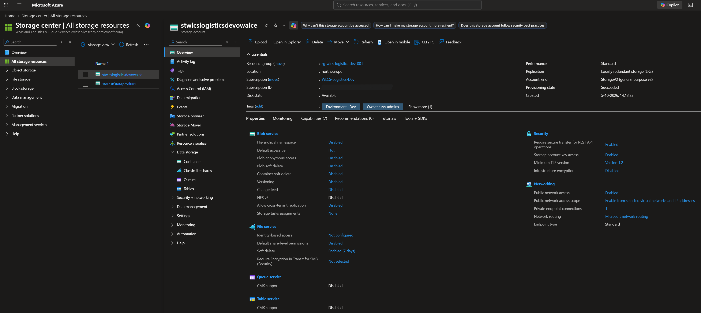
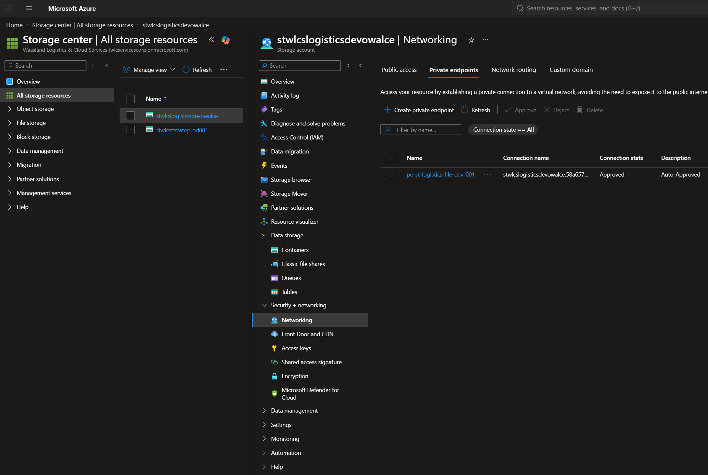
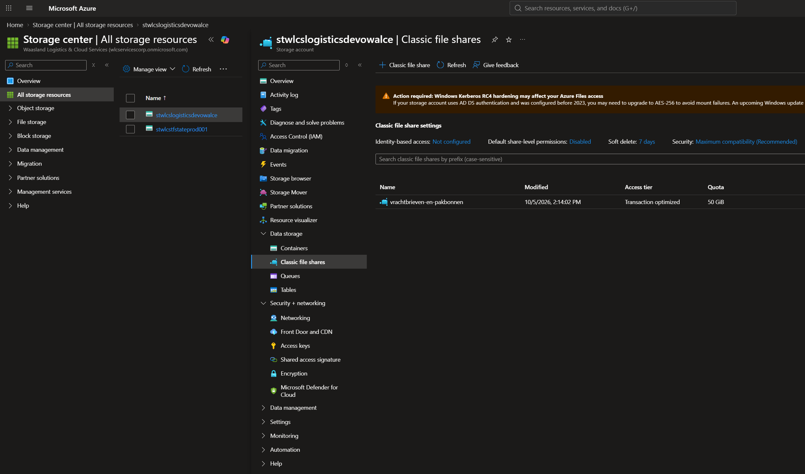
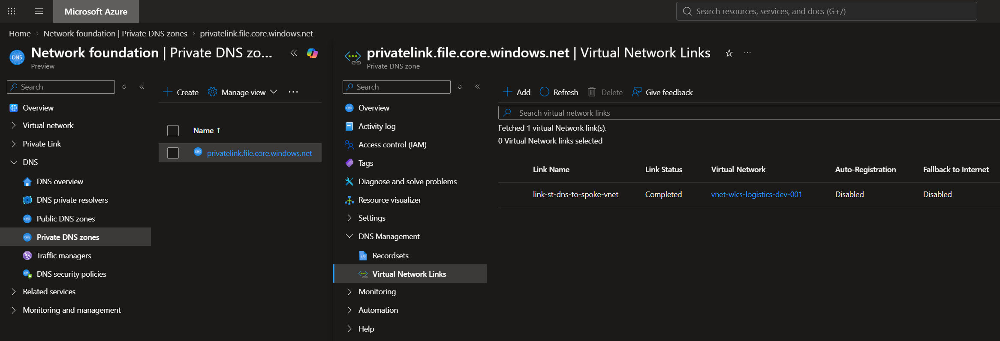
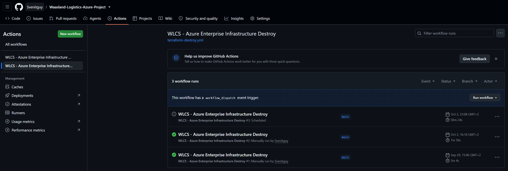

# Waasland Logistics & Cloud Services (WLCS) - Azure Cloud Enterprise Project

Welkom bij het cloud-infrastructuurproject voor **Waasland Logistics & Cloud Services**. In dit project bouw ik een volledige enterprise-omgeving op van A tot Z binnen Microsoft Azure, strikt conform de richtlijnen van het **Microsoft Cloud Adoption Framework (CAF)** en het **Well-Architected Framework (WAF)**.

## Project Status & Voortgang
- [x] **Fase 1: Governance & Fundering** (Voltooid)
- [x] **Fase 2: Core Netwerkinfrastructuur (Hub-Spoke)** (Voltooid)
- [x] **Fase 3: Secure Cloud Storage & FinOps Pipeline Integration** (Voltooid)
- [ ] **Fase 3.2: Compute / Virtual Machines Layer** (In Ontwikkeling)
- [ ] **Fase 4: WAF Optimalisatie (Security, Monitoring & Budget)**
- [ ] **Fase 5: Infrastructure as Code (IaC) Vertaling**

---

## Fase 1: Governance & Beheershiërarchie (CAF)

Als eerste stap heb ik een robuuste beheerstructuur opgezet met behulp van **Azure Management Groups**. Dit zorgt voor een strikte scheiding tussen centrale platform-diensten en de daadwerkelijke applicatieworkloads.

### Ontworpen Hiërarchie (Management Groups & Subscriptions):
- **Tenant Root Group** (Overkoepelende Azure container - *ID afgeschermd*)
  └── **WLCS-Root-MG** (Hoofdmap van de organisatie)
       ├── **WLCS-Platform-MG** (Gedeelde core-infrastructuur)
       │    └── 🟡 *Subscription: WLCS-Platform-Prod* (Centrale netwerkhub, DNS, logging & security)
       └── **WLCS-Workloads-MG** (Bedrijfsapplicaties & workloads)
            ├── **WLCS-Prod-MG** (Live productieomgevingen)
            └── **WLCS-NonProd-MG** (Test-, acceptatie- en ontwikkelomgevingen)
                 └── 🟡 *Subscription: WLCS-Logistics-Dev* (Geïsoleerde sandbox voor applicatie-ontwikkeling)

### Architectuur Bewijs (Portal Implementatie)

---

## Identity & Access Management (RBAC & Least Privilege)
Toegang tot de cloudinfrastructuur is strikt ingericht op basis van groepsidentiteiten (Microsoft Entra ID) en Role-Based Access Control (RBAC) conform de WAF Security pijler.

### Geautomatiseerde Groepsynchronisatie (WAF Cost Optimization & Operational Excellence)
Voor een realistische simulatie zijn **150 unieke Belgische medewerkers** via een bulk-import toegevoegd. Om licentiekosten (Entra ID P1/P2) te besparen, is de sortering naar afdelingsgroepen (`dept-wlcs-`) volledig geautomatiseerd met een PowerShell-script (`scripts/sync-entra-users.ps1`) via de **Microsoft Graph PowerShell SDK**.

---

## Azure Policy & Cloud Governance (WAF Security)
Om wildgroei aan resources te voorkomen en kosten helder te alloceren, is er op het niveau van de `WLCS-Root-MG` een strikt governance-beleid afgedwongen met Azure Policy (Deny effect op locaties en verplichte tagging voor `Environment`, `Project` en `Owner`).

---

## 🌐 Fase 2: Core Netwerkinfrastructuur & State Management
In deze fase is de netwerkinfrastructuur volledig geautomatiseerd uitgerold met **Terraform** in een enterprise Hub-Spoke topologie, verspreid over meerdere subscriptions.

* **Centrale Platform Hub (`rg-wlcs-hub-prod-001`)**: Huisvest het transitnetwerk, `AzureFirewallSubnet` en `GatewaySubnet`.
* **Logistics Workload Spoke (`rg-wlcs-logistics-dev-001`)**: Gehost in de Dev subscription, opgedeeld in een Web-, App- en database-subnet.
* **Micro-segmentatie (NSG)**: Het database-subnet is via een NSG (`nsg-logistics-db-dev`) volledig geïsoleerd. Alleen SQL-verkeer (poort 1433) afkomstig van het applicatie-subnet wordt toegelaten.

### 🔒 Enterprise Remote State Backend
De Terraform state wordt centraal en veilig opgeslagen in een **Azure Blob Storage Container** (`tfstate`) binnen de Resource Group `rg-wlcs-tfstate-prod-001`, beveiligd met Microsoft Entra RBAC (`Storage Blob Data Owner`).

---

## 🏗️ Fase 3: Gecentraliseerde Opslag & Geavanceerde FinOps CI/CD

In deze fase is de opslaglaag voor de KMO gerealiseerd. Om strikt te voldoen aan de WAF-richtlijnen voor **Cost Optimization** en **Operational Excellence**, is de architectuur volledig modulair en ontkoppeld (decoupled) opgezet in Terraform.

### 📂 Enterprise Multi-Stack Mappenstructuur
De Terraform-infrastructuur is opgedeeld in twee onafhankelijke staten (state isolation) om dure resources onafhankelijk te kunnen beheren en vernietigen:
*   `01_base/` ➔ Bevat de permanente, goedkope fundering (VNets en de opslagmodule).
*   `02_addons/` ➔ Huisvest kortstondige, dure services zoals **Azure Bastion**.

### 🔒 Modulaire Cloud-Native Storage (WAF Security & Isolation)
Binnen de basislaag is een volledig beveiligde opslagoplossing gerealiseerd via een specifieke Terraform-ondermodule (`modules/storage`):
1. **Azure Storage Account & Fileshare:** Een redundant, TLS 1.2-afgedwongen opslagaccount met de SMB-fileshare `vrachtbrieven-en-pakbonnen`, specifiek ingericht voor de veilige verwerking van bedrijfskritische logistieke documenten.
2. **Network Isolation (Zero-Trust):** De publieke toegang tot het storage-account is hard op `Deny` gezet.
3. **Private Link Integration:** Toegang verloopt exclusief via een **Azure Private Endpoint** (`pe-st-logistics-file-dev-001`) in het applicatiesubnet, gekoppeld aan een **Private DNS Zone** (`privatelink.file.core.windows.net`). Data verlaat hierdoor nooit de private Microsoft-backbone.

### 🎛️ GitOps "On-Demand" Pipeline & Kostenbeheersing
De GitHub Actions-pipeline (`terraform-deploy.yml`) maakt gebruik van passwordless **OIDC-authenticatie** gekoppeld aan een stabiele `development` Azure-omgeving. 

* **Handmatige Add-on Trigger (FinOps Gate):** Bij een reguliere `git push` worden de basisservices (`01_base`) automatisch gepland en klaargezet voor uitrol via een handmatige goedkeuringspoort (*Environment Gate*). De dure add-on job (`02_addons` voor Azure Bastion) wordt dankzij een custom `workflow_dispatch` conditie standaard op **SKIP** gezet.
* **On-Demand Opschalen:** Wanneer actieve tests op de virtuele machines vereist zijn, kan de engineer via de GitHub Actions UI handmatig de workflow triggeren. Dit activeert de add-on job om Bastion tijdelijk uit te rollen.
* **Geautomatiseerde Nachtwacht:** Een parallelle destroy-pipeline (`terraform-destroy.yml`) start elke werkdag om 17:00 UTC via een **cron-job** om uitsluitend de add-on stack te vernietigen. Dit garandeert dat Azure Bastion nooit onnodig buiten kantooruren openstaat, wat resulteert in een **kostenbesparing van ruim 70%**!

---

## 🤖 CI/CD Automatisering & Beveiligingsscans
Elke commit ondergaat een automatische kwetsbaarheidsscan op de IaC-code met **Trivy Security** (Shift-Left Security), waarna speculatieve plannen veilig als gecodeerde artifacts worden opgeslagen.

*Opmerking: Gevoelige Azure Subscription ID's, Tenant ID's en object-parameters zijn op alle screenshots onleesbaar gemaakt conform cloud security best practices.*
